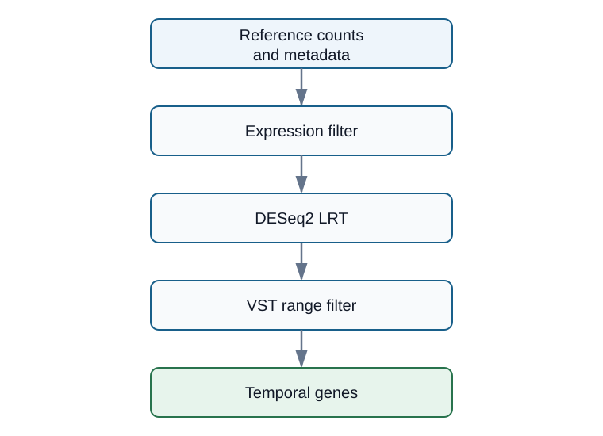
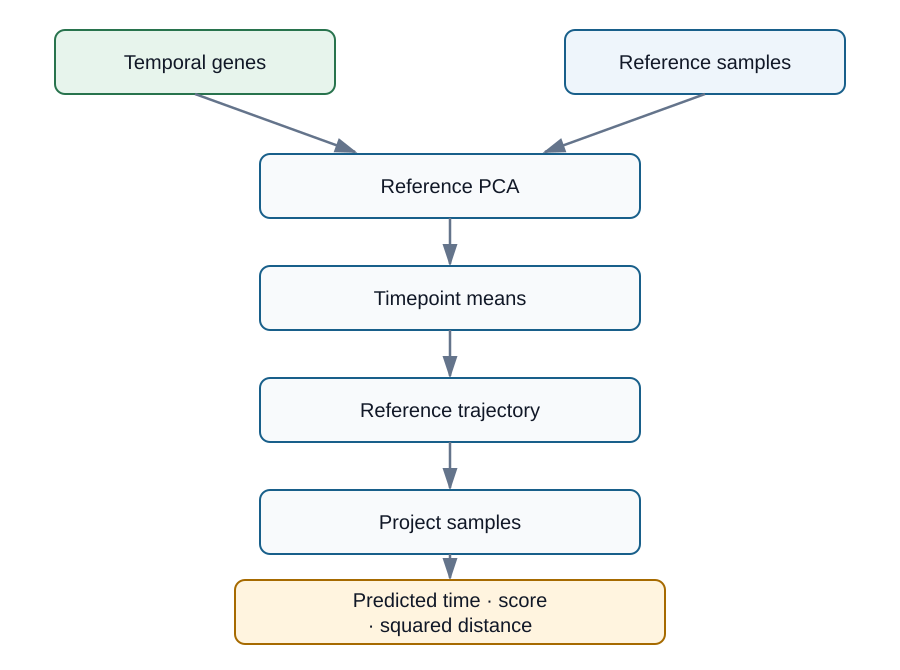

# Differentiation timing score

[See differentiation maturation scoring example here.](https://zohebkhan1.github.io/pca-maturation-scoring/)

If you have bulk RNA-seq samples collected across a differentiation time course, you can use the time-course expression pattern to estimate where other samples fall along that course. This workflow defines a transcriptomic clock in principal-component space.

Given raw counts, variance-stabilized expression, and sample metadata, the workflow selects genes that change over the reference time course and projects samples onto the resulting trajectory. It returns predicted reference time, a score scaled between the reference endpoints, and squared distance from the trajectory.

## API

- [`get_temporal_genes()`](functions/get_temporal_genes.R) selects genes with time-dependent expression using raw counts, VST expression, and sample metadata.
- [`score_differentiation_timing()`](functions/score_differentiation_timing.R) fits a reference trajectory and projects samples onto it.
- [`run_loo_maturation()`](functions/run_loo_maturation.R) repeats gene selection and trajectory scoring while holding out each cell line for validation.

## Quick start

Temporal-gene selection requires `DESeq2` and `edgeR` from Bioconductor:

```r
install.packages("BiocManager")
BiocManager::install(c("DESeq2", "edgeR"))
```

The code below uses your own `counts`, `vst`, and `metadata` objects. It downloads the two functions used for gene selection and scoring; it does not download the example data.

```r
download.file(
  "https://raw.githubusercontent.com/ZohebKhan1/pca-maturation-scoring/main/functions/get_temporal_genes.R",
  "get_temporal_genes.R",
  mode = "wb"
)
download.file(
  "https://raw.githubusercontent.com/ZohebKhan1/pca-maturation-scoring/main/functions/score_differentiation_timing.R",
  "score_differentiation_timing.R",
  mode = "wb"
)

source("get_temporal_genes.R")
source("score_differentiation_timing.R")

# Keep both matrices in metadata sample order.
sample_ids <- as.character(metadata$sample_id)
counts <- counts[, sample_ids, drop = FALSE]
vst <- vst[, sample_ids, drop = FALSE]
```

## Select temporal/time-dependent genes

`get_temporal_genes()` applies three filters within the reference samples. A gene must pass all three filters to be used for the trajectory:

1. Expression filter: retain genes with sufficient expression across reference timepoints.
2. DESeq2 LRT: retain genes for which categorical time improves the count model, after any requested covariate adjustment.
3. VST-range filter: retain genes with enough variation across reference timepoints in VST expression.



```r
temporal_selection <- get_temporal_genes(
  raw_counts = counts,
  vst_expression = vst,
  metadata = metadata
)

temporal_genes <- temporal_selection$temporal_genes
```

## Define the reference differentiation trajectory

`score_differentiation_timing()` fits centered, unscaled PCA to the mean temporal-gene profile at each reference timepoint. It connects the ordered timepoint centroids with line segments and projects each sample to its nearest point on that trajectory.



```r
timing_fit <- score_differentiation_timing(
  expression_matrix = vst,
  metadata = metadata,
  temporal_genes = temporal_genes
)

timing_fit$scores[, c(
  "sample_id",
  "observed_time",
  "predicted_time",
  "differentiation_score",
  "squared_distance"
)]
```

To score new samples, select temporal genes and fit the trajectory using reference samples that are not part of the scored set, then pass those IDs through `reference_samples`. Reference samples need finite timepoints; scored non-reference samples may have missing timepoints.

## Input requirements

- `get_temporal_genes()` requires integer-like, unnormalized counts. It calculates TMM CPM internally and also requires VST expression with the same gene and sample identifiers as the count matrix.
- `get_temporal_genes()` requires one metadata row per expression sample, matching sample IDs, and finite numeric timepoints.
- `score_differentiation_timing()` requires matching sample IDs, normalized expression such as VST expression, and temporal genes selected without using the samples being scored.
- `run_loo_maturation()` requires count and VST matrices plus metadata containing `sample_id`, `cell_line`, and `day_numeric`; it selects genes and fits the trajectory separately for each held-out cell line.

## Interpret the result

`timing_fit$scores` contains one row per sample:

- `predicted_time` is the estimated position on the original reference-time scale.
- `differentiation_score` maps the earliest and latest reference timepoints to 0 and 1.
- `squared_distance` is the squared distance to the nearest fitted trajectory segment in PCA space.

The score is relative to the selected reference. Compare scores within the same reference frame and inspect `squared_distance` when a sample may not fit the learned trajectory.

## Data and tutorial

The repository includes processed metadata, raw counts, and VST expression from [GEO accession GSE122380](https://www.ncbi.nlm.nih.gov/geo/query/acc.cgi?acc=GSE122380). These files support the tutorial but are not required for the Quick start. The tutorial source is [`docs/tutorial/tutorial.Rmd`](docs/tutorial/tutorial.Rmd), and the rendered tutorial is available [on GitHub Pages](https://zohebkhan1.github.io/pca-maturation-scoring/).

The tutorial covers the full analysis workflow, figures, leave-one-cell-line-out validation, interpretation, and adaptation. The functions are [`get_temporal_genes.R`](functions/get_temporal_genes.R), [`score_differentiation_timing.R`](functions/score_differentiation_timing.R), and [`run_loo_maturation.R`](functions/run_loo_maturation.R).

## Citations

1. Love MI, Huber W, Anders S. Moderated estimation of fold change and dispersion for RNA-seq data with DESeq2. *Genome Biology*. 2014;15:550. [doi:10.1186/s13059-014-0550-8](https://doi.org/10.1186/s13059-014-0550-8)
2. Robinson MD, McCarthy DJ, Smyth GK. edgeR: a Bioconductor package for differential expression analysis of digital gene expression data. *Bioinformatics*. 2010;26(1):139–140. [doi:10.1093/bioinformatics/btp616](https://doi.org/10.1093/bioinformatics/btp616)
3. Strober BJ, Elorbany R, Rhodes K, et al. Dynamic genetic regulation of gene expression during cellular differentiation. *Science*. 2019;364(6447):1287–1290. [doi:10.1126/science.aaw0040](https://doi.org/10.1126/science.aaw0040)
4. [NCBI GEO accession GSE122380](https://www.ncbi.nlm.nih.gov/geo/query/acc.cgi?acc=GSE122380)
